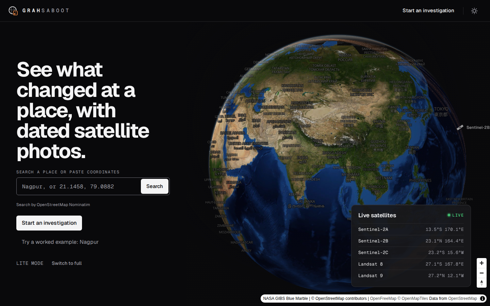
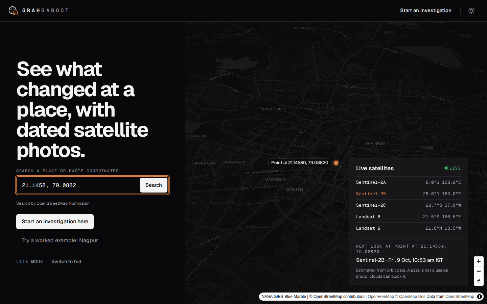
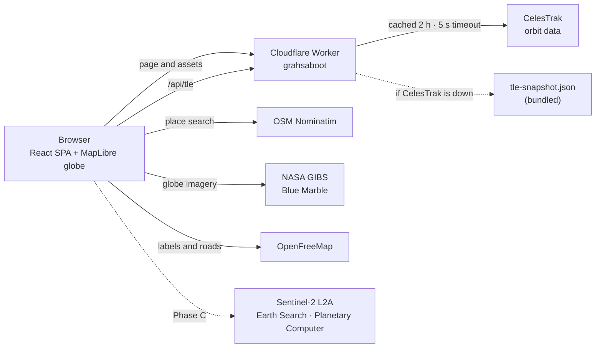

# GrahSaboot

**Satellite proof for any place.** *Grah* (ग्रह) means planet and *Saboot* (सबूत) means proof.

GrahSaboot turns a place and a set of dates into dated, cloud-checked satellite evidence from free Sentinel-2 imagery. The goal is to let anyone check what was visible from above, for example whether a road or building really appeared where and when it was claimed, at no cost.

**Live prototype:** https://grahsaboot.grahsaboot.workers.dev



---

## What works in this prototype

- **A live 3D globe.** NASA Blue Marble imagery on a MapLibre globe that rotates slowly on large screens. It has a dark theme (the default) and a light theme.
- **Live Earth-observation satellites.** Sentinel-2A, 2B and 2C, plus Landsat 8 and 9, are computed every second from real orbit data. Each satellite shows:
  - its marker and name, hidden when it is on the far side of the globe;
  - a dashed ground track;
  - its imaging swath.
- **Place search.** Search for a place by name (OpenStreetMap Nominatim) or paste coordinates such as `21.1458, 79.0882`. The globe flies there and drops a labelled pin.
  - If Indian coordinates are typed the wrong way round, you get a one-tap fix.
- **Next pass.** For the place you picked, the panel estimates the next daytime pass that will photograph it. That satellite's row and track turn orange.
- **It works on any device.** The app checks the device and picks a level:

  | Tier | When | What you get |
  |---|---|---|
  | T0 | No WebGL2, or a software GPU | No 3D map. Search and the satellite list still work. |
  | T1 | Data saver, slow network, or 2 GB of RAM or less | Flat 2D map. Satellites are listed in the panel. |
  | T2 | 4 cores or fewer, or less than 4 GB of RAM | Globe with satellite markers, tracks and swaths |
  | T3 | Everything else | Everything in T2, plus 3D terrain |

  On T1 and T2 you can choose "Switch to full".
- **Accessible.** Every screen is tested with axe against WCAG 2.2 AA in both themes. Reduced motion is respected.



**Not in this prototype yet:** the investigation workbench (drawing an outline, comparing dated photos, making a report) and accounts. "Start an investigation" currently opens a page that says so. The evidence engine behind the workbench is already built and tested; see [Roadmap](#roadmap).

## How it works



- **One Cloudflare Worker** serves the built app and one API route, `/api/tle`.
  - That route fetches orbit data for the five satellites from CelesTrak and caches it at the edge for 2 hours, which follows CelesTrak's policy.
  - After a failure it backs off for 15 minutes.
  - When CelesTrak is down and nothing is cached, it serves a snapshot of the orbits bundled with the build.
- **Orbits are computed in the browser**, inside a Web Worker, with SGP4 (`satellite.js`).
  - Positions update every second; tracks and swaths every 30 seconds.
  - The next-pass search scans 10 days ahead and refines each candidate to 1 second. It keeps descending, daytime passes whose swath covers the place.
- **Search** calls Nominatim only when you press Search, at most once per second, and caches the results.
- **Evidence engine (built in Phase A, used in Phase C):** this code lives in `src/evidence` and `src/stac`. It:
  - reads Sentinel-2 cloud-optimised GeoTIFFs straight from public AWS buckets;
  - hashes the exact source pixels (SHA-256);
  - scores clear view per date from the Sentinel-2 scene classification (SCL) layer;
  - reprojects everything onto a shared grid, so dates can be compared.

## Tech stack

| Area | Choice |
|---|---|
| App | React 19.3, TypeScript 7, Vite 8 |
| Styling | Tailwind CSS 4.3, Geist and Geist Mono fonts, Base UI 1.8, Phosphor icons |
| Map | MapLibre GL 6.12 (globe projection), terra-draw 1.36 (outlines, Phase C) |
| Orbits | satellite.js 7.1 (SGP4) |
| Imagery | geotiff 3.0, proj4 2.22 |
| Edge | Cloudflare Workers (static assets plus `/api/tle`), wrangler 4.147 |
| Tests | Vitest 5 (unit), Playwright 1.63 with axe-core (end-to-end and accessibility) |
| Later | Supabase (Postgres, PostGIS, Google sign-in, a Deno `verify` function) in Phase D |

## Run it locally

You need Node 22 or newer.

```bash
npm ci
npm run dev          # http://localhost:5173, with a local /api/tle that calls CelesTrak
```

No environment variables are needed. Every service URL has a public default in `src/config.ts`, and you can override any of them with a `VITE_*` variable such as `VITE_NOMINATIM_URL` or `VITE_TLE_URL`.

| Script | What it does |
|---|---|
| `npm run dev` | Development server |
| `npm run build` | Production build into `dist/` |
| `npm run preview` | Serves the production build locally |
| `npm run check` | Type check, unit tests and build, all together |
| `npm run e2e` | Playwright tests against fixture data. Pick browsers with `E2E_BROWSERS=chromium,firefox`. |
| `npm run e2e:live` | Playwright tests against the real services |

## Deploy

The app is hosted on **Cloudflare Workers**, on the free plan. It is not on Vercel. The Worker is named `grahsaboot`, and you can find it in the Cloudflare dashboard under Workers & Pages.

```bash
npm run build          # always a fresh production build: npm run e2e leaves a test build in dist/
npx wrangler deploy    # uploads dist/ and the worker in worker/
```

Pushing to GitHub does not deploy anything; you deploy by running `wrangler`.

Refresh the bundled orbit snapshot now and then. Run it at most once every 2 hours, as CelesTrak asks:

```bash
node -e "fetch('https://celestrak.org/NORAD/elements/gp.php?GROUP=resource&FORMAT=json',{headers:{'user-agent':'GrahSaboot/1.0'}}).then(r=>r.json()).then(a=>require('fs').writeFileSync('public/tle-snapshot.json',JSON.stringify(a.filter(o=>[40697,42063,60989,39084,49260].includes(o.NORAD_CAT_ID)))))"
```

## Project layout

```
src/
  app.tsx, main.tsx   routes and app entry
  ui/                 design system: tokens, kit, shell, search box, satellites panel; copy.ts holds every UI string
  map/                persistent MapLibre globe, device tiers, camera, satellite layers
  sats/               satellite catalogue, orbit maths, next-pass search (Web Worker)
  search/             Nominatim client (throttled, cached)
  evidence/           evidence engine: COG windows, SHA-256, cloud stats, reprojection, difference
  stac/               Sentinel-2 STAC search (Earth Search, with Planetary Computer as fallback)
  workers/            imagery Web Worker
  geo/                coordinates and outline limits
worker/               Cloudflare Worker: /api/tle (edge cache, back-off, snapshot fallback)
public/               icons and tle-snapshot.json
tests/e2e/            Playwright end-to-end and accessibility tests
tests/fixtures/       fixture server and data for end-to-end tests
docs/                 design mockups, plans, research, probes
```

## Roadmap

| Phase | Status | Delivers |
|---|---|---|
| A: Foundation | Done | Toolchain, geometry, the evidence engine (COG reads, SHA-256 frames, `scl-v2` cloud stats, reprojection, difference), STAC clients, imagery worker |
| B: Shell and globe | Done, live | Design system, router and shell, globe with device tiers, place search, live satellites and next pass |
| C: Workbench | Next | New-investigation flow, workbench (swipe, side by side, difference), timeline, road sections, notes, report export |
| D: Accounts | Planned | Google sign-in, saving, server re-verification of every frame, privacy controls |

## Limits and honesty

- **What the photos show:** they are 10 m per pixel and go back to 2017. Clouds often block the view, especially in the monsoon.
- **What they cannot show:** quality, payments or who did the work. "No visible change" does not prove that nothing happened.
- **Next-pass times are estimates** from orbit data. A pass is not a guaranteed usable photo.
- The full list is in the app at `/limits`.

## Privacy

- **Accounts:** the prototype has none, and no database. Your theme choice stays in your browser.
- **Place searches** go to OpenStreetMap Nominatim.
- **Satellite positions** come through our Worker from CelesTrak. Nothing about you is sent to CelesTrak.
- The full summary is in the app at `/privacy`.

## Data and credits

- Contains modified Copernicus Sentinel data, used from Phase C onwards.
- Globe imagery: NASA GIBS Blue Marble.
- Map data © OpenStreetMap contributors, styles by OpenFreeMap and OpenMapTiles.
- Orbit data: CelesTrak. Place search: OpenStreetMap Nominatim. Terrain: AWS Terrain Tiles.

## How it was built

Krish Potanwar planned and built this prototype on 5–6 October 2026, working with Claude Code:
- Claude Opus planned and reviewed;
- Claude Sonnet agents implemented each task, and every task was reviewed before the next one started;
- the prompts were spoken, in English and Hinglish, with Wispr Flow.
