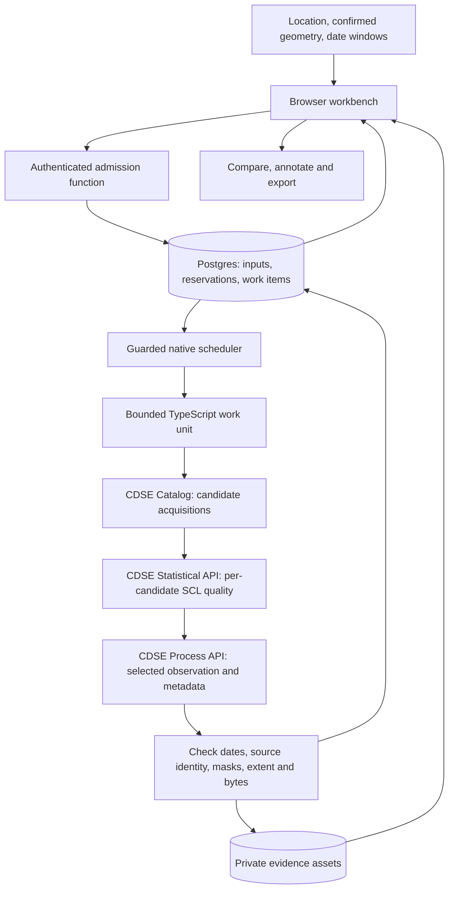

# GeoVerify: revised product and technical design

Date: 5 October 2026. Revision R2. **Proposed design for review, not implemented or runtime-validated.** This is the current recommendation. The 1 October files are historical drafts; this revision takes precedence where they differ. Its factual basis is the [fresh revalidation](REVALIDATION.md), not the original slide deck or earlier recommendations.

## 1. Recommendation

Build a **dated satellite evidence workbench** using CDSE Sentinel Hub's managed Catalog, Statistical and synchronous Process APIs. Use a small TypeScript frontend and Supabase for authentication, state, private assets and short server functions. First establish a reliable site/road → dated observations → comparison → notes → portable report workflow. The automatic construction classifier remains a separate experiment.

This preserves your **B+C** choice: a provider performs satellite processing; users inspect the evidence. It changes the proposed managed interface from openEO batch jobs to bounded requests for individual observations. It also replaces the proposed sleeping Render/FastAPI gateway with Supabase Edge Functions. These are recommendations, not decisions already approved by you. Keep openEO as an evaluated alternative, without implementing two providers at once.

The reason is concrete: CDSE documents a catalogue-first, per-acquisition Process API workflow, normal server OAuth credentials, and image-plus-metadata responses. This better matches the first product's previews than a general batch-processing engine. It still requires live tests for source identity, quality statistics, latency, credits and recovery. [Time series](https://documentation.dataspace.copernicus.eu/APIs/SentinelHub/UserGuides/TimeSeries.html), [metadata](https://documentation.dataspace.copernicus.eu/APIs/SentinelHub/UserGuides/Metadata.html), [examples](https://documentation.dataspace.copernicus.eu/APIs/SentinelHub/Process/Examples/S2L2A.html).

## 2. Product requirements retained

| Requirement | R2 behaviour |
|---|---|
| Commercial product, initially free | Bounded public pilot; new user coordinates and dates, private results |
| Large buildings/sites **and** roads | Polygon input and road centreline/full-width input; both must work before release |
| Before/after **and** multi-date timeline | Explicit date windows, actual acquisitions, visible gaps, section navigation |
| Free/open imagery, variable resolution | Sentinel-2 first; no purchased imagery or invented higher-resolution detail |
| One month, initial ₹0 | Twenty-working-day target, conditional on gates; no spending or delivery guarantee |
| B+C | Managed observations with user inspection/annotations; no free human analyst service promised |
| Private users need no government record | Optional claim text and observable milestone; location/date comparison works without it |
| Scale ambition | Measure demand, provider use and retention; increase only the bottleneck that actually limits use |

India-first remains an explicit assumption, not a confirmed geographic restriction or nationwide performance claim. Start validation in selected Indian settings. Demand is still **not validated**, there is still **no reachable tester**, and team availability is unknown. A working technical demonstration does not resolve any of those facts.

User-visible output: **“Here are the usable dated observations, what is obscured, and your recorded interpretation.”** It cannot certify contract completion, spending, abandonment, interior work, structural safety or use/opening. “No clear visible change” does not establish that no construction occurred.

## 3. Three approaches reconsidered

| Approach | Advantage | Remaining burden | Decision |
|---|---|---|---|
| **R2: scene-by-scene managed previews + workbench** | Matches comparison/timeline directly; provider supplies rendering and quality statistics; no long-lived remote batch-job catalogue | Server credentials, bounded request work, provenance checks, private storage, retry accounting | **Probe first; recommended for month one** |
| R1: openEO batch processing + workbench | Rich process graphs and heavier analytical workflows | Experimental M2M account/credit setup; remote job reconciliation; result collection/expiry; per-frame export semantics | Select if R2 fails evidence/runtime gates or a demonstrated analytical need justifies it |
| Direct public STAC/COG processing + workbench | More control over source selection and local calculations | Operate raster I/O, masking, memory, alignment and worker recovery | Reserve as an explicit change to processing placement; not a silent fallback to unselected A |

None changes sensor resolution. None has demonstrated GeoVerify accuracy or capacity. A commercial Earth Engine pipeline is not the ₹0 default: commercial intent does not become eligible noncommercial use because the app launches free. See the [provider audit](research/2026-10-05-provider-audit.md).

## 4. Proposed stack and why each component exists

| Component | Choice | Responsibility and ceiling |
|---|---|---|
| Browser | React, Vite, TypeScript, Leaflet, native date inputs | Geometry confirmation, image comparison, timeline, notes, printable/downloadable evidence |
| Static hosting | Cloudflare Pages | Frontend assets; not the satellite processing runtime |
| Identity | Supabase Auth, one Google OAuth login initially | Private investigation ownership; public non-team login must be tested |
| Data | Supabase Postgres | Immutable inputs, observations, work items, reservations, annotation revisions |
| Geometry | PostGIS in a dedicated non-public extension schema | Validate polygons; metric areas/distances; buffer and section roads using native geospatial functions |
| Short server execution | Supabase Edge Functions, TypeScript | Authenticate, admit work, call fixed provider endpoints, ingest bounded outputs |
| Scheduling | Supabase Cron + pg_net, guarded by pending work | Wake short work units independently of an open browser |
| Imagery | CDSE Sentinel Hub Catalog + Statistical + Process | Discover acquisitions, calculate SCL quality statistics, render individual observations |
| Evidence storage | Supabase private bucket | Retained PNGs, quality views, source metadata and portable manifests |
| Verification | Deno tests, database integration tests, Playwright for core user journeys | Meaningful behaviour checks; real provider probes supplement mocks |

PostGIS is proposed for an immediate geometry responsibility, not hypothetical future scale. It replaces custom distance/buffer/topology code. Supabase documents the extension; geography buffering has dateline/very-large-extent caveats. Reject unsupported geometries rather than silently repairing or wrapping them. [Supabase PostGIS](https://supabase.com/docs/guides/database/extensions/postgis), [buffer semantics](https://postgis.net/docs/ST_Buffer.html).

Supabase supports scheduled Edge calls using pg_cron/pg_net and recommends Vault for credentials. The worker endpoint needs its **own server-only authorization**; a public project key alone is not sufficient. Free Edge limits currently include 256 MB memory, 2 CPU seconds/request and 150 seconds wall time. Native scheduling does not provide an availability guarantee or override project pausing. [Scheduling](https://supabase.com/docs/guides/functions/schedule-functions), [Cron](https://supabase.com/docs/guides/cron), [runtime limits](https://supabase.com/docs/guides/functions/limits).

Do not add Python/GDAL to the live application initially, Redis, Celery, Kubernetes, an LLM inference API, a vector database, agent orchestration servers or a training pipeline. Python can remain useful for later independent scientific evaluation. Use one provider implementation and ordinary functions; no speculative provider framework.

## 5. Pipeline

### 5.1 Confirm geometry and freeze intent

A coordinate locates the map; it is not a project boundary. Accept a site Polygon or a road LineString plus the **full** corridor width. Validate numeric ranges, topology, size, vertices and bounding dimensions server-side. Show the derived road corridor for confirmation. Break a road into stable sections, retaining submitted-route chainage. These are measurements of the user's geometry, never satellite-derived road length.

Freeze the geometry, method version and canonical date windows. Before and after refer to two distinct ordered windows in this same set. All windows count toward one limit. Missing selections remain gaps; replacement outside the admitted request is new work, not an invisible date expansion.

### 5.2 Discover before expensive rendering

Search the catalogue first, with bounded pagination. Rank candidates deterministically by date proximity and catalogue metadata; scene-wide cloud percentage is only a search aid. Retain all considered IDs and rejection reasons. If the catalogue scan cap is reached, say **“search limited”**; it does not prove there are no other usable acquisitions.

For each section/window, examine at most three candidate acquisition groups initially. Select a real acquisition group, potentially containing adjacent tiles from the same pass. Avoid monthly median composites for the first method: they can merge different dates and complicate event timing. Keep the acquisition group and every contributing tile, not just the search window's midpoint.

### 5.3 Measure observation quality, not construction

Use the Statistical API to count SCL classes/source coverage over the submitted geometry, at an explicitly declared 20 m quality grid. Keep separate counts for inside-AOI cells, source nodata, policy-rejected classes and policy-accepted cells. Never discard cloudy cells from the denominator and then call the remaining area fully observable. Store denominator rules, grid, request and response.

The initial quality policy rejects nodata/defective, shadow, cloud/cirrus, snow and uncertain classes for selection, while preserving the reason and a quality view. Version this policy; SCL is an imperfect classification, not a guarantee of cloud-free evidence. Rank candidates by accepted fraction, then date distance, then stable source ID. Zero accepted cells yields a gap; a nonzero fraction does not automatically make construction interpretation reliable. Show partial coverage and source quality explicitly.

Do not aggregate road quality into “percentage road completed.” First show a **section × date** evidence matrix. Defer a whole-road coverage scalar until nonoverlapping spatial weighting and missing-data semantics are tested.

### 5.4 Render the same selected evidence

Request RGB PNG, a quality view and metadata for the same acquisition group/selection as the quality calculation. Use an explicit fixed display stretch and grid. Record native RGB sampling (10 m), quality sampling (20 m), output grid and resampling separately. The PNG's display size is not its information resolution.

Catalogue IDs, provider scene IDs and actual contributing scenes are different concepts. The day-one probe must establish their mapping, including overlapping tiles and reprocessed products. Filter/pin source selection using supported metadata, verify the returned scene set, and reject discrepancies. A narrow time window alone is not sufficient proof of exact scene identity. Statistics and preview must agree on source group, geometry and masking method.

Record the Sentinel processing baseline and provider method/service version where exposed. The fresh science audit identifies baseline 05.13's edge-pixel correction. If older products need detector-footprint handling that this API cannot establish, flag/reject affected boundary evidence or select another verified path. Never claim the newer fix retroactively repaired every old image. See [science audit](research/2026-10-05-science-audit.md).

### 5.5 Publish progressively, preserve evidence

Prioritize the user's before/after windows, then the remaining timeline; roads retain section-level status throughout. Copy accepted output bytes into private storage before publishing an immutable manifest revision. A successful provider response alone is not a published report. Do not retain expiring URLs as the evidence itself.

Keep actual scenes, request/response metadata, method/evalscript hash, quality policy, acquisition times, bounds/CRS/grid, asset hashes, generation time and source notices. The first release offers evidence reproducibility from retained inputs/settings; it does **not** promise a permanent bit-identical rerender after provider processing changes. Preserve the displayed output for its disclosed retention window.

Display machine evidence availability separately from user interpretation. Users can record change/no clear change/uncertainty and reasons, tied to observations. The optional supplied claim stays attributed text. Export sanitized HTML with embedded retained images and provenance JSON; browser print supports PDF. No separate PDF server is necessary.

## 6. State, retry and quota contracts

Use `analyses`, `observations`, `work_items`, `attempts`, `annotations`, and `deletion_tombstones`; an analysis owns its immutable geometry, windows and scene-selection metadata. A simple single-analysis investigation avoids a separate project/workspace system in month one. Relational constraints and ownership checks apply to every linked object. JSON metadata is appropriate for immutable provider evidence, not mutable counters requiring atomic updates.

Work item phases are `DISCOVER`, `QUALITY`, `RENDER`, `PUBLISH`, `PURGE`; states are `PENDING`, `CLAIMED`, `SUCCEEDED`, `GAP`, `RETRY_WAIT`, `HOLD`, `CANCELLED`. Analysis state summarizes progress: `QUEUED`, `RUNNING`, `PARTIAL`, `READY`, `INSUFFICIENT`, `HOLD`, `CANCELLED`, `DELETED`. `PARTIAL` may have published evidence and unfinished work; show both facts. An analysis becomes terminal only when every admitted cell has a result or explicit reason.

Admission runs in one database transaction: owner/idempotency/fingerprint check → validate geometry/windows → check user/shared limits and reserved allowance → create immutable analysis/work items. Same key and same fingerprint returns the existing analysis; changed fingerprint returns `409`. Known saturation returns `429` **before** accepting intent. Accepted work returns `202`. Provider unavailability after acceptance becomes visible pending/hold state.

The scheduler conditionally invokes a worker only when eligible work exists and no active application-wide provider claim exists. A worker atomically claims bounded work, reserves the attempt's allowance and records a fencing/version token; it commits the result only if that token still owns the item. An expired claim does not prove a remote HTTP request was free or never executed. A transport timeout can hide a successful billable response: count/reserve the uncertain attempt and hold it for controlled retry. Cancellation stops new dispatch and hides/deletes results as requested; a request already sent may finish and consume allowance.

Start with one provider request in flight application-wide. A work invocation has a **proposed 90-second application deadline**, inside the published 150-second wall limit; individual provider requests have a proposed 30-second deadline, with ingestion time reserved. A guarded 10-second database tick is a candidate to probe, not a promise of ten-second result latency. Atomic claims must survive overlapping invocations. A stale worker cannot publish after cancel/delete. No work depends on the browser staying open.

This removes remote batch-job creation/inventory/cancellation and signed-provider-result renewal. It **does not remove durable work state, claims, idempotency, private storage or retry accounting**.

## 7. Operational bounds and unit economics

All numbers below are proposed admission controls, not measured capacity or sensor detectability thresholds.

| Resource | Initial proposal |
|---|---|
| Site | ≤1 km², bounded projected raster extent |
| Road | ≤10 km centreline, ≤200 m full width, ≤2 km² corridor; ≤5 sections of ≤2 km |
| Dates | ≤12 canonical windows across ≤24 months; no future endpoint; monthly or explicitly sparse/coarse choices |
| Candidate examination | ≤3 acquisition groups per section/window; catalogue ≤5 pages ×100 records per analysis |
| Source/display grid | ≤1024 ×1024 requested cells/frame, explicit CRS and resolution; subdivide/reject oversized bounds |
| Provider work | One call in flight; two analyses/day/user; one unfinished analysis/user |
| Shared admission | ≤20 nonterminal analyses, including held/ambiguous work; lower measured resource limit wins |
| Output | ≤4 MiB per provider response, ≤25 MiB retained evidence/analysis, with pre-dispatch reservations |
| Retention | Images seven days; manifests/notes thirty days, both from first durable publication; publish exact deadlines |

Bounds are cumulative: a 60-frame road may not fit the output budget even though its road length passes. Preflight and reject with an explanation; do not silently drop frames. A reduced request needs explicit user confirmation. Limit failed/retried attempts as well as successful assets.

For five sections and twelve windows there are 60 section-window cells. Three quality calls and one render call/cell plus five catalogue calls gives **245 planned calls before retries**, a request-count illustration, not a service guarantee. Catalogue truncation and multi-source limitations may make the request incomplete. SH has distinct request and PU meters; pixels, input bands, samples, formats and bounding boxes affect PU use. Failed transport may conceal billable provider success. [PU rules](https://documentation.dataspace.copernicus.eu/APIs/SentinelHub/Overview/ProcessingUnit.html).

Measure a ledger containing provider requests/PUs, Edge invocations/CPU/wall time, database bytes, evidence bytes-days, download egress, backups and operator effort. Derive available analyses from the **minimum** of remaining request, PU, function, storage and egress allowances divided by the measured workload, after reservations and headroom. Do not divide free quotas by registered users or quote a universal “free users supported” number.

₹0 is an initial cash constraint, not zero operating consumption. Existing computer/internet, operator time and any existing coding-assistant subscription are separate inputs. Paying for a host does not automatically enlarge imagery-provider quotas. No automatic paid failover or purchase is authorized.

## 8. Privacy, retention and recovery

Use owner-bound rows/RLS and private object paths; service-role credentials remain server-only. Authorize cron/worker separately from user APIs. Provider endpoints are fixed/allowlisted; users cannot submit scripts or arbitrary fetch URLs. Validate response types, bounded bytes and archive member names; never extract provider archives to arbitrary paths. Strip credentials/signed URLs from logs and manifests. Sanitize claim/annotation text in HTML exports.

Signed asset links are short-lived capabilities, proposed ≤5 minutes; deleting a report blocks new links immediately but must not falsely promise instant revocation of every issued link. Retention starts at first partial or complete durable publication, and later edits/frames do not reset it. Failed/cancelled unpublished metadata expires thirty days after terminal status; minimal cleanup IDs persist only as needed to resolve cleanup. A global purge job handles expired/deleted objects and orphaned uploads.

A recoverability promise requires actual database **and object-byte** backups plus a restore test. For the pilot, propose a daily encrypted operator-owned local backup only if an accountable operator and storage are available; the recovery-point target is 24 hours, unproven until tested. If that cannot be operated, disclose the lack of managed recovery and hold the current recoverable-history release requirement for revision; do not invent a backup service. Apply a current deletion ledger to any restored older snapshot before reopening access. Delete requests must also cover backup expiry/purge policy and already-running provider responses.

## 9. Creative improvements, ordered by evidence and effort

| Idea | Value to test | Month-one decision |
|---|---|---|
| Coverage/calendar first | Show whether useful dates exist before full rendering; make cloudy gaps understandable | Include bounded catalogue preview and honest scan-limit status |
| Before/after first, timeline fills next | User sees useful evidence sooner while their full admitted request continues | Include; reserve the entire admitted workload first |
| Road section/date matrix | Makes missing stretches obvious without inventing road completion percentages | Include |
| Portable evidence packet | Users can share a retained factual record with an engineer without an online public link | Include offline HTML/JSON export |
| Refine the time of a suspected change | After user marks absence/presence, request intervening observations to narrow the interval | Later, explicitly admitted and metered; never infer an exact start date |
| Season-matched comparator/control area | Help distinguish vegetation/soil cycles from site-specific change | Later experiment, independent validation; control area is not truth |
| Structured observable milestones | “New roof footprint visible” or “surface change along this section” is more useful than a contract verdict | Include optional plain-text criterion; no automated certification |
| Sentinel-1 during monsoon | Potential additional evidence through clouds | Research branch only; SAR geometry/speckle/moisture confounders need separate validation |
| User-supplied dated field evidence | May connect imagery to actual milestone decisions | Interview first; uploads, privacy and provenance add scope, no automatic ground-truth status |
| High-resolution learned model/super-resolution | Attractive demo, poor fit without matching data rights and validated transfer | Exclude from month one; LEVIR's commercial-use restriction is material |

The most valuable scale improvement may be narrowing to the first repeatable customer decision, not adding infrastructure. Preserve both requested asset classes while testing which workflow yields actual use.

## 10. Release gates and implementation authority

1. **Account/provider gate:** commercial downstream service is supported in CDSE's general FAQ, but this application's credentials, allowance and terms configuration are actually usable. No account quota bypass.
2. **Evidence gate:** scene mappings, statistics/preview agreement, processing baseline, edge/nodata handling and exact dates pass on both asset classes; unsupported cases abstain.
3. **Runtime gate:** bounded end-to-end requests fit CPU/memory/time/byte limits, survive timeout/restart/overlap, and operate with the browser closed.
4. **Product/security gate:** new public-user queries, private retrieval, notes, export, cancellation, retention and restore/deletion behaviour work; no secret leakage or cross-user access.
5. **Claim gate:** numerical accuracy, construction attribution and measurements remain disabled until independent evaluation supports each claim.
6. **Demand gate:** observe a real tester performing a decision task. Missing demand evidence means an unvalidated pilot, not a validated business.

The [implementation plan](IMPLEMENTATION_PLAN.md) specifies task ownership, contracts, tests and failure decisions. It is written now because you explicitly requested a plan alongside research. No application code, account configuration, provider job, installation, deployment, outreach or purchase has been performed as part of this revision.
