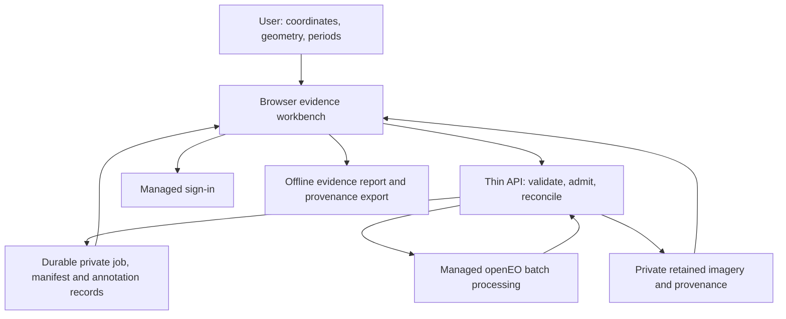

# Design: GeoVerify managed imagery and evidence workbench

Generated through office-hours and brainstorming on 1 October 2026.

Status: DRAFT FOR USER REVIEW. Mode: Startup. Branch: main.

Project: GeoVerify in `Idea lab laa`; this is a new planning project inside a larger parent repository. Package location: `docs/geoverify/`. The parent repository's unrelated projects and changes are outside scope.

## Problem and smallest useful product

An organisation or individual wants to investigate whether visible construction-related change occurred at a place during a period. The original attachments describe government-sanctioned project audits; the user's request broadens that to a self-service location/time comparison.

The proposed first product is a bounded live web pilot: submit a confirmed site or road corridor, inspect before/after satellite observations and a dated timeline, record findings, and download an evidence report. Both large sites and roads remain in scope. The report helps decide whether closer inspection is warranted. It does not certify expenditure, accepted completion, structural safety or hidden work.

Demand is explicitly “not validated yet”, with “No reachable tester yet”. No actual user's existing workaround, cost, willingness to pay or operational decision has been established. Candidate users are site owners, civil engineers and monitoring teams; these are recruitment hypotheses, not identified customers. Technical feasibility and commercial usefulness have separate gates.

## Decision record

- **Commercial, free initially:** D1 establishes product intent; free access does not make development noncommercial or compute free.
- **Sites and roads:** D4 selected both; no validated minimum footprint or road width follows from that choice.
- **Comparison and timeline:** D5 selected both; missing intervals stay visible rather than becoming physical-progress percentages.
- **Free/open imagery, variable resolution:** D6 establishes the sourcing constraint; paid imagery is not a selected fallback.
- **One month, ₹0 initially, paid hosting when needed:** D8 establishes the target and transition, not an unspecified purchase or unlimited free capacity.
- **B+C:** D9 selected provider-managed processing plus evidence review. This is the current route. A, self-hosted raster processing, was recommended during discovery but not selected.
- **Claim checking:** conditionally useful under D5; proposed as an optional user-supplied claim beside evidence, not a mandatory sanctioned-record workflow.
- **India-first:** assumption A-001 after “continue” at D7; validate selected regions before any geographic performance claim.
- **Minimal stack:** Ponytail ultra applies. Reuse managed processing, identity/storage and native browser controls/printing. Add infrastructure or models when a measured need justifies them.

Full answers and alternatives remain in [LOGBOOK.md](LOGBOOK.md) and [APPROACHES.md](APPROACHES.md). The original academic targets and stack are reference proposals, not adopted requirements or results.

## Proposed architecture

The candidate stack is React/Vite and Leaflet for the browser, Python/FastAPI with the official openEO client for a thin API, CDSE openEO for managed raster processing, and Supabase Auth/Postgres/private object storage for retained state. Cloudflare Pages plus a limited Render API instance is a free-host feasibility profile, not a demonstrated reliable deployment. One Google OAuth provider is proposed to avoid relying on restricted default email delivery; user fit and non-team sign-in must pass before launch.

There is no public provider token and no client-controlled processing graph. The API owns geometry/date/workload limits, a durable request record, a single-provider-job admission lease initially, provider status reconciliation and bounded result collection. Objects and provenance are retained before an investigation is marked ready. Provider completion, application availability and retained report readiness are separate facts.

C initially means **users inspect and annotate their own evidence**. A paid analyst service, organisation roles, billing and recurring monitoring are expansion hypotheses. User notes do not become independent truth or model confidence. Proposed access retention is seven days for image/results and thirty days for manifest/annotations from first durable report publication. Preview durations/start rule before submission and exact deadlines at publication; minimal cleanup IDs remain until resolved.

## Pipeline and evidence contract

Confirm geometry and time windows → validate and reserve allowance → submit a versioned managed process graph → prepare comparable observations and quality information → reconcile provider state → retain bounded assets and full provenance → display comparison/timeline → user review/optional claim → export.

The manifest carries source identifiers, acquisition dates or composite support periods, native sampling, grid, method/settings, masks, valid coverage and gap reasons. A composite timestamp is not an exact acquisition date or per-pixel source guarantee. Roads are sectioned with traceable geometry and overlap handling; partial sections do not establish whole-road completion. No observation is silently invented or range expanded.

A public automatic surface-change layer stays disabled until a quality/evaluation gate supports an explicitly experimental policy. Automatic construction attribution and physical quantities need stronger, separate references and release criteria. No trained-model ensemble or GPU is presumed necessary. The user can still inspect dated evidence and author findings without an automatic verdict.

Details, data records, states, failure handling, security and stack choices belong in [TRD.md](TRD.md); the product contract is [PRD.md](PRD.md). [HOW_IT_WORKS.md](HOW_IT_WORKS.md) explains the flow with illustrative site/road reports.

## Access, budget and recovery gates

Managed computation moves raster work away from our API; it does not prove ₹0 application capacity or commercial account suitability. CDSE's machine-to-machine identity has separate jobs and credit balance, and its authentication path is documented as experimental. Account-specific allowance and required linkage must be demonstrated before promising unattended processing. [CDSE client credentials](https://documentation.dataspace.copernicus.eu/APIs/openEO/authentication/client_credentials.html)

Provider budget enforcement is unproven for this application. Use bounded work, measured credit reservations and a shared allowance stop; never rely on an untested parameter to prevent spending. Failed/ambiguous jobs are reconciled rather than automatically resubmitted. Every host/storage candidate needs a restart, pause, expiry and restore probe. Paid always-on hosting may be necessary for timely collection before broad traffic, not only after a particular user count.

Proposed initial admissions are at most 1 km² for a site; 10 km/200 m full corridor width/2 km² for a road; twelve distinct windows within twenty-four months; and twenty accepted nonterminal analyses shared across the application. Monthly defaults fit twelve months; longer requests use visible coarser/sparser windows. Comparison selects two ordered request windows; missing evidence does not trigger a silent replacement. Transactional admission checks the shared queue, user limits, idempotency and resource reservation before accepting intent. These are provisional safeguards, not validated capacity or detector limits. Review measured credits, latency, memory, retained bytes and egress before public use.

No purchase, account setup, cloud deployment, imagery experiment or implementation is performed by this document. If the free live profile fails, hold that launch and review a concrete paid transition or another managed provider; a static demo remains an interim outcome. Do not silently switch to A.

## Four-week delivery and success criteria

Week 1 establishes backend identity/credits, commercial access, both-asset observation/provenance probes and reference supply. Week 2 establishes reproducible managed jobs, quality/gap handling, comparison and timeline contracts. Week 3 integrates the review/report workflow and proves interruption, retention, privacy and quota behaviour. Week 4 evaluates locked settings, observes testers if recruited, measures resources and records a bounded-live release or hold.

The minimum live success is newly submitted requests for both assets yielding usable evidence or honest no-data states, with before/after/timeline, private retrieval, authored notes, offline export and recovery/quota protection. Automatic features are independently gated; broad accuracy or commercial validation is not part of that minimum claim. No latency/accuracy SLA is agreed before measurement. Exact working dates and available people remain unknown.

[CHECKPOINTS.md](CHECKPOINTS.md) supplies twenty working-day checkpoints, project-group evaluation, a proposed 24-project exploratory target, demand tests, experiment/resource templates and scale triggers. The small sample exercises feasibility; it is not a release accuracy benchmark.

## Distribution and scale

Users receive the browser service at a published project URL. Examples are explicitly labelled; live submissions have the enabled caps and expiry policy. There is no existing GeoVerify deployment pipeline. Proposed future release checks are frontend build, focused API/geometry/access/reconciliation checks and a preview review, followed by an operator-controlled deployment. Production deployment is not automatic from an unreviewed change. Keep a method version and rollback path so earlier evidence stays traceable.

Scale the bottleneck that measurements reveal: provider allowance/admission, always-on collection, storage/egress, queue capacity, then useful workbench features. A single durable relational job store is enough initially; no Redis/Celery, PostGIS, microservices, GPU fleet or Kubernetes is required merely by an ambition to scale. New regions, measurements and automatic labels need external evidence before expanded claims.

## Dependencies and open decisions

Detailed stack and admission/retention policies need user review. Live provider access/credits, account terms, provenance completeness, bounded outputs, durable recovery and non-team authentication need probes. Independent references, an evaluator and a reachable tester need sourcing. Team capacity, exact start and later paid spending cap need declaration before an accountable delivery/cost commitment. These are recorded gaps with checkpoints, not filled with invented numbers.

## The assignment

Prepare six prospective contacts, split between large-site and road roles, and seek three twenty-minute sessions. Ask them to show their existing change-checking workflow and try one known site without a guided demo. Record the decision the report changes, evidence they distrust and whether they will bring a second site. The human owner selects and contacts people; no invitations have been sent.

## Session observations

- You stated “not validated yet” and “No reachable tester yet”; the design keeps demand evidence separate from technical feasibility.
- You selected both sites and roads, and both comparison and timeline; the one-month plan preserves those choices.
- You chose “B plus C”; the document follows that combination rather than retaining the earlier A recommendation.
- You set “the budget initially is zero” and a later paid-hosting path; scale decisions therefore use measured limits and an explicit future budget.

## Review status

The package completed two independent document-review passes. Four material contract issues were fixed: retention clocks, shared waiting/admission limits, post-snapshot deletion recovery and canonical comparison windows. Two smaller wording improvements and one state-description clarification were also applied. The reviewer reported PASS on completeness, consistency, clarity, scope and feasibility of the conditional plan; its final subjective document score was 9/10. No material document-review concerns remain.

User review is pending. Confirming B+C does not imply approval of every detailed policy or evidence claim. Application execution gates are all untested; a document score is not technical accuracy, capacity or launch evidence. The [project index](README.md) lists the artifacts; [KNOWLEDGE_DUMP.md](KNOWLEDGE_DUMP.md) preserves primary-source research and attachment corrections.
