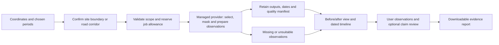

# How GeoVerify will work

Date: 1 October 2026. Status: proposed B+C product flow, for review. The examples below are illustrative, not processed projects or performance results.

## What a user receives

GeoVerify prepares an evidence report for a selected place and periods. It combines provider-processed satellite observations with a workspace where the user compares images and records what they can see. It supports large sites and road corridors, both before/after comparison and a timeline. A government-sanction record is optional.

The user receives dates and source details as part of the answer. If imagery is obstructed, missing, too coarse or otherwise unsuitable, the report identifies the gap. The first product helps a user judge whether closer inspection is needed; it does not certify the entire project from a changed footprint.

## 1. Define the investigation

Coordinates centre the map. The user confirms the actual footprint by drawing a polygon for a warehouse/factory/campus, or a centreline and corridor width for a road. The selected area matters: a road beside the intended site can change without the site changing. The interface shows what will be analysed before the job is submitted.

The user chooses before/after periods and a timeline range. Their distinct windows form one request with a twelve-window limit; comparison selects two ordered windows. The provider may have no usable image on an exact chosen date. GeoVerify shows actual acquisitions or composite support periods and does not quietly extend the range. A missing comparison window stays a gap until the user explicitly chooses another. A longer timeline can contain fewer, coarser windows under the initial limits.

## 2. Prepare the observations

The backend checks geometry, dates, access and remaining shared allowance, then creates a recoverable job record. The selected route sends a versioned processing graph to a managed provider, initially proposed as CDSE openEO. Its access, quotas and required operations still need a live account-specific probe.

The provider prepares crops/road sections, cloud and shadow quality information, comparable grids and image outputs. GeoVerify retains which source observations contributed, how they were processed and where evidence is missing. Native band resolution remains part of the manifest: resampling a 20 m band onto a 10 m grid does not create additional observed detail. [Sentinel-2 mission specification](https://sentiwiki.copernicus.eu/web/s2-mission)

The thin backend collects bounded outputs into retained private storage and reconciles interrupted work with provider job IDs. A backend restart cannot automatically trigger another chargeable analysis. Source availability, provider processing and result collection are separate status stages.

## 3. Compare and inspect

The workspace shows a before/after view with an accessible side-by-side option, plus dated timeline observations. Missing intervals stay visible. For long roads, the user can inspect sections and see which sections/periods lack usable evidence; partial coverage does not become a whole-road completion verdict.

If a generic surface-change overlay passes its exploratory quality gate, it is labelled experimental and displayed separately. It can point to places to inspect. It cannot by itself explain the cause of change: vegetation, soil moisture, flooding, demolition and shadows may confuse a comparison.

The user records observations tied to evidence. These notes identify their author and reasoning. They are not independently validated labels merely because they appear in a report.

## 4. Optional claim review

A user can add a claim such as “the visible paving was present by the end of this period”. The report shows the claim next to dated observations and the user's interpretation. It separates visible paving from acceptance, opening for traffic, workmanship or other criteria that require additional evidence.

No claim is needed for normal comparison. A sanctioned cost or start/end date does not define a valid expected physical-progress percentage curve.

## Two illustrative reports

**Large site:** earlier observations show open ground; a later usable observation shows a roof-like footprint in the selected area. A user records that visible footprint change. The report includes the images and dates. It does not infer finished interiors, structural safety, expenditure or completed contract scope.

**Road corridor:** some sections show a visible corridor change, while others are cloudy or too narrow to interpret. The report shows those sections, their actual dates and gaps. It does not turn changed-pixel area into paved-road kilometres or call the whole road completed. If a milestone is absent in one usable observation and present in the next, its onset is bounded between those dates; the gap determines how precise that interval can be.

## 5. Keep and export the evidence

The proposed pilot offers seven days of image/result access and thirty days of manifest/note access from first durable report publication. Before submit the user sees durations and the start rule; exact deadlines appear at publication. Later edits do not extend them. The user can download a report containing selected images and provenance JSON; browser printing provides a PDF path. Exports must work without expiring provider links. Private reports require access controls, and deletion/cancellation/backup cleanup status remains visible. Minimal cleanup identifiers may outlive a report while external work or older backups are resolved.

These retention policies are proposals for review, not a permanent-history promise. The project knowledge dump and logbook are durable planning files and are separate from this application retention policy.

## The one-month outcome and scale path

The intended outcome is a bounded live public pilot for users' own locations and periods. A labelled static example is an intermediate demonstration. The detailed [TRD](TRD.md) specifies the pipeline, stack and failure handling; [CHECKPOINTS](CHECKPOINTS.md) states what must pass before live release.

Start with managed processing, a thin API and durable private job/result storage. Measure provider credits, queue/collection delays, retained bytes and user-review effort. Add paid always-on hosting or storage when free runtime/retention cannot meet the selected service behaviour. Expand regions, automatic claims, measurements and repeat monitoring only after their validation and user-need gates pass.
