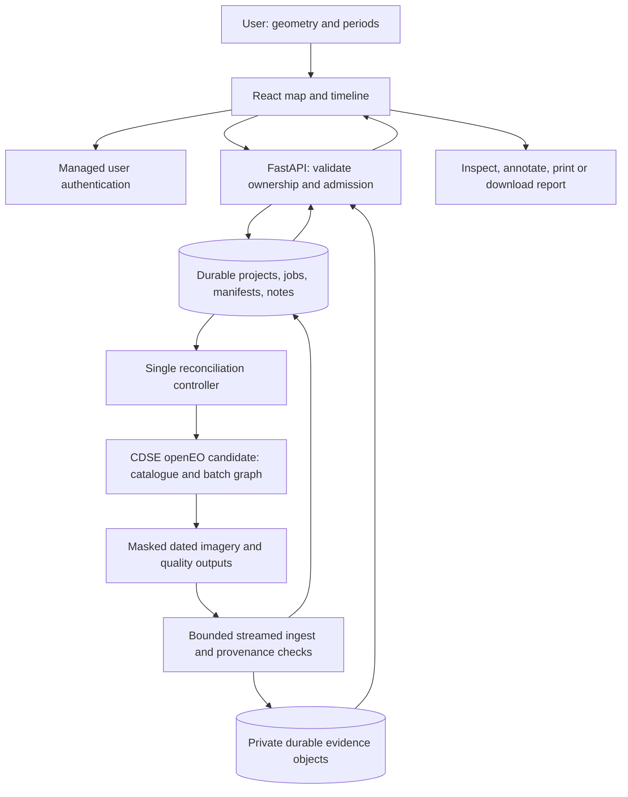

# GeoVerify technical requirements draft

Date: 1 October 2026. Status: reviewable planning draft; no implementation, deployment, benchmark, purchase, or provider account approval.

## 1. Decisions, scope, and release boundary

The user selected **B plus C**: managed satellite processing and an evidence workbench. The commercial product launches free; it must cover large buildings/sites and roads/highway corridors, before/after comparison and a multi-date timeline, using free/open imagery with variable resolution. The target is one month and ₹0 initial cash spending. Paid hosting is a later planning option when free services do not fit; no amount or purchase is authorised. India-first remains a planning assumption. Team capacity, demand, and a reachable tester remain unresolved.

The intended public workflow processes newly submitted locations and periods. A local prototype, invitation-only demonstration, or precomputed gallery is an explicitly labelled interim outcome, not fulfilment of open public self-service. A bounded public pilot can reject oversized or unavailable requests honestly. No availability, turnaround, nationwide accuracy, or unlimited capacity commitment is established.

C initially means **users inspect and annotate their own evidence**. It does not promise a free analyst service. The first release presents observations, quality, dates, and user-authored notes. Construction attribution, automated public change overlays, and physical measurement each require separate evaluation. No model training, completion certification, expenditure verification, precise construction-area calculation, detected road-length promise, or automatic progress percentage belongs in this draft.

## 2. Architecture and component responsibilities

Use a small React/Vite/Leaflet client, a thin Python FastAPI service using the official openEO Python client, and one durable managed store for identity, relational state, and private result objects. **CDSE openEO and Supabase are candidates**, subject to account, terms, capability, and workload checks. There is no silent self-hosted raster-processing fallback. Provider failure stops or defers work; selecting another processing route requires an explicit design revision.

The client handles geometry confirmation, requested periods, status, side-by-side images, section navigation, timeline gaps, annotations, and report presentation. It contains no provider credentials. The API authenticates users, validates requests, applies resource budgets, signs authorised asset access, and commits state. The controller submits and reconciles provider jobs; it can share the API deployment initially, but its execution does not depend on a browser remaining open. The database is authoritative for application state. Object storage owns retained report assets. Provider state is an external observation, not a substitute for either store.

CDSE's core endpoint is the candidate target; federation partners are not selected automatically. The official client supports asynchronous batch execution and later retrieval. A real-job probe must confirm the required graph operations and result formats. [CDSE openEO](https://documentation.dataspace.copernicus.eu/APIs/openEO/openEO.html), [official client](https://docs.openeo.cloud/getting-started/python/)

## 3. Admission and provisional workload policy

Coordinates locate the map; the user confirms a polygon or a route with its actual full corridor width. Reject ambiguous geometry rather than inventing a project footprint. Validate GeoJSON type, longitude/latitude bounds, finite numbers, topology, vertex count, and nonempty extent. Calculate resource area and route distance in a suitable metric reference system; these are measurements of **submitted geometry**, not satellite-derived construction.

These starting bounds are proposed resource controls, not validated detector limits:

| Control | Proposed pilot bound |
|---|---|
| Large site | One confirmed polygon, area at most 1 km² |
| Road | One route at most 10 km; full corridor width at most 200 m; resulting corridor area at most 2 km² |
| Dates | At most 12 explicit, ordered observation bins inside an overall span at most 24 months; no future bin endpoints |
| Sampling | Default monthly bins for spans up to 12 months; coarser or sparse bins for longer spans, with their windows displayed |
| Provider capacity | One active provider job for the entire service account, not one per user; one concurrent provider API call initially |
| User admission | One unfinished analysis and two admitted analyses per user per day, subject to a smaller shared credit/storage allowance |
| Shared waiting bound | At most 20 accepted nonterminal analyses application-wide initially, including active, waiting, quota-blocked and unresolved external attempts; provisional and subject to a lower measured cap |
| Outputs | Provisional 25 MiB retained evidence per analysis; export bundle below the selected store's per-file limit |
| Raster/display dimensions | Provisional native-sampled section/site bounding grid at most 1024 × 1024 cells per frame; preview longest side at most 1024 pixels, never advertised as additional native detail |
| Monitoring | User-requested runs only; no automatic periodic project monitoring |

Split roads into stable sections no longer than 2 km. Limit candidate acquisition scans, graph size, output dimensions, and download bytes before start. All caps are configuration under a versioned admission policy, checked on representative building and corridor jobs before public admission. Oversized requests receive an actionable resource-limit response; no minimum detectable building size or road width is established.

Area alone does not bound rectangular raster reads: diagonal or thin geometry can have a much larger bounding box. Check projected bounding dimensions/estimated bytes before dispatch and process frames sequentially. Any bounded display-conversion fallback must pass peak-memory, cold-import, time, nodata and alignment checks in the actual gateway runtime. If it cannot fit safely, choose a suitable host or revise preview preparation; do not silently clip evidence or change the analysis sampling.

Reserve a conservative credit/storage allowance before submission and settle it against measured use. CDSE currently documents 10,000 monthly openEO credits, two concurrent processing jobs, and request/start limits. This is an account allowance, not free capacity for each GeoVerify user; Sentinel Hub processing units are a different quantity. The backend advertises no estimator endpoint, and requested budget enforcement is not proven. Until representative consumption and account balance checks establish a safe admission policy, public job admission stays disabled. [CDSE quotas](https://documentation.dataspace.copernicus.eu/Quotas.html), [credit accounting](https://documentation.dataspace.copernicus.eu/APIs/openEO/credit_usage.html)

Admission is transactional: look up owner/idempotency/fingerprint, then check the shared record cap, per-user limits, usable allowance and reserved credits/storage before creating accepted intent. A duplicate returns its existing analysis without another reservation; changed inputs under that key conflict. Known queue/quota exhaustion returns `429` before a new accepted record is created. Accepted intent returns `202`; allowance that becomes unavailable afterward can move that bounded record to `BLOCKED_QUOTA`. The provider slot and waiting-record cap are different limits. Unresolved provider attempts continue counting until reconciled; deleting or timing out a request cannot release a still-active remote slot.

## 4. Managed imagery and evidence pipeline

1. **Normalise and plan.** Freeze geometry revision, bins, method, admission policy, and request fingerprint. Check supported region/date/source availability and the server's usable account balance. Catalogue absence becomes a dated evidence gap, not a no-construction finding.
2. **Build the graph.** Use the candidate `SENTINEL2_L2A` collection. Filter the submitted geometry/time and required bands. Preserve candidate and actually consumed source identities separately. A candidate catalogue search alone does not prove which products the graph consumed.
3. **Apply quality handling.** Request RGB and suitable quality outputs. Sentinel-2 RGB and B8 are native 10 m; SCL and B11/B12 are native 20 m. Exclude or flag nodata, defective pixels, clouds, cirrus, shadows, snow, and uncertain classes using a versioned policy. Nearest-neighbour resampling of categorical SCL onto a 10 m display grid adds no quality detail. If SWIR indices are later added, their native 20 m support remains visible. Scene-level cloud percentage never replaces site-level valid-area evidence. [Sentinel-2 specification](https://sentiwiki.copernicus.eu/web/s2-mission), [processing and limitations](https://sentiwiki.copernicus.eu/web/s2-processing), [products](https://sentiwiki.copernicus.eu/web/s2-products)
4. **Select observations.** Prefer one suitable acquisition per bin for the first method. Multi-tile mosaics retain every acquisition and source item. Missing quality-qualified acquisitions leave gaps. If a composite becomes necessary, preserve its actual contributing dates/support window and composite rule; never label it as a photograph taken on the bin's anchor date.
5. **Export evidence.** Return dated previews, valid/rejected masks, coverage statistics and source metadata. Prefer provider RGB PNG from one explicitly selected observation or reduced bin, ordered B04/B03/B02, with a fixed versioned display stretch and nodata handling. Never send a multi-date cube to PNG expecting one frame per date: current upstream implementation collapses time, and a real batch must prove distinct multi-output assets and provenance. PNG is not the georeferencing authority; retain bounds, CRS, grid/transform and mask associations separately and test Leaflet display alignment on a compatible projected grid. Retain analytical rasters required for reproducibility. If native multi-frame preview generation fails, a documented bounded GeoTIFF-to-PNG display conversion in the gateway is an alternative, not a self-hosted analysis fallback. It requires a runtime/memory probe before selection. Record reflectance scaling/offset, resampling, acquisitions and processing versions. No synthetic sharpening adds claimed observed detail. [Live formats](https://openeo.dataspace.copernicus.eu/openeo/1.2/file_formats), [CDSE PNG example](https://documentation.dataspace.copernicus.eu/APIs/openEO/R_Client/R.html), [upstream implementation](https://github.com/Open-EO/openeo-geopyspark-driver/blob/master/openeogeotrellis/geopysparkdatacube.py)
6. **Ingest and publish.** Stream bounded assets to private durable storage, calculate byte counts/hashes, ingest root/child STAC and source metadata, verify completeness, then atomically publish the manifest and report state. Provider `finished` alone never becomes application `READY`.
7. **Review.** Users inspect original dated views, masked regions, resolution, and gaps, then save explicitly attributed observations. The optional claim is separate text with its own author and requested milestone; it cannot turn an image into contractual certification.

Use CDSE's documented STAC 1.1 output option to obtain `derived_from` source-item collections when supported; persist those documents and their signed-link targets while accessible. Source IDs, acquisition dates, processing versions, and the graph must be recoverable from an actual job. Missing provenance is a release blocker, not a field filled with a guess. [CDSE result provenance](https://documentation.dataspace.copernicus.eu/APIs/openEO/openeo-backend/docs/job-result-stac11.html)

## 5. Roads, timeline, and interpretation semantics

Each road section has stable geometry and submitted-route chainage. For every bin record its selected observation, valid fraction, missing/rejected reason, and asset links. At project level report observable corridor-area coverage with nonoverlapping geometry weights, plus the section-by-bin matrix. Do not average section percentages equally or convert valid coverage into constructed road length. An unobserved section remains unknown; clear changes elsewhere do not establish the whole road's status.

Before/after selectors reference two distinct ordered bins in one canonical request. Timeline windows and separately selected comparison periods form that request; identical windows are deduplicated, all distinct windows count toward the twelve-window cap, and their relationship is previewed before submission. The before window must end no later than the after window starts. A missing selected bin remains a comparison gap; selecting another requires an explicit user choice. A replacement outside the canonical request requires a newly admitted analysis rather than an invisible range expansion.

The timeline shows actual acquisitions or explicit composite support intervals against requested bins, with blanks where evidence is unavailable. No interpolation of physical completion, smooth progress curve, or automatic abandonment label is permitted. If users record a feature absent in one clear observation and present in a later one, the apparent onset lies between those observations; that is a user interpretation with temporal uncertainty.

Machine evidence states are `COMPARISON_AVAILABLE`, `PARTIAL_EVIDENCE`, and `INSUFFICIENT_EVIDENCE`, accompanied by reasons. User notes may express apparent change, no clear change, or uncertainty, but retain author/date and are never promoted to validated machine findings. Public generic overlays require independent locked-method evaluation and an approved release policy, with unmistakable experimental wording if exposed experimentally. Construction classifications and measurements remain independently gated. Minimum valid coverage, registration tolerance, and seasonal comparability policies must be evaluated and frozen before any corresponding automated conclusion is enabled.

## 6. Durable logical data model

These are logical schemas, not SQL migrations. Identifiers are opaque; each private record carries an owner or inherits ownership through its analysis. Relational constraints prevent orphaned attempts/assets. Immutable analysis inputs and manifests coexist with versioned user notes.

| Entity | Essential fields and invariants |
|---|---|
| User | Managed-auth subject, account state, quota tier; identity provider owns credentials |
| Project | ID, owner, name, asset class, confirmed GeoJSON, route/full-width fields if applicable, geometry revision, creation/deletion timestamps |
| Analysis | ID, project/owner, immutable bins/input fingerprint, idempotency key, method/admission versions, public state, phase, reserved resources, failure reasons, last reconciliation, result and metadata expiry |
| Provider attempt | Analysis/attempt IDs, unique submission marker, remote job ID if known, observed provider state, graph hash, account identity, lease/version, retry count, measured credits, reconciliation error |
| Section | Analysis ID, stable section ID, geometry, submitted-route chainage and nonoverlapping aggregation weights |
| Observation | Section/bin IDs, requested window, actual acquisitions/support interval, source references, native/display resolution, valid fraction/mask, quality status/reasons |
| Asset | Analysis/observation IDs, opaque private key, media type, bytes, hash, source URL origin, ingest state, retention deadline; no permanent public provider URL |
| Manifest/report | Version, graph/settings, source STAC snapshot, legal notices, observations, quality exclusions, hashes, machine evidence state, immutable report snapshot |
| Annotation | Owner, analysis/observation references, optional drawn feature, plain-text note, optional claim, revision, creation/edit timestamps; user-authored status |
| Resource/audit record | Reservation/settlement IDs, attempt linkage, consumption, state transitions, cancellation/deletion requests; scrubbed operational detail |

Candidate Supabase combines Auth, PostgreSQL, and private objects to avoid three separately operated systems. Its free plan currently lists 500 MB database and 1 GB object storage; limits, inactivity pausing, absence of automatic free backups/SLA, and account terms require verification. It is a feasibility candidate, not a reliability commitment. [Pricing](https://supabase.com/pricing), [pausing](https://supabase.com/docs/guides/platform/free-project-pausing), [backups](https://supabase.com/docs/guides/platform/backups), [terms](https://supabase.com/terms)

## 7. Application request and result contracts

JSON bodies follow these contracts; the API returns stable error codes, a readable message, field errors, and a correlation ID without secrets. No request accepts arbitrary provider endpoints, credentials, process graphs, or download URLs.

| Operation | Request and response |
|---|---|
| Create project | Asset class, name, confirmed geometry and optional route/width; returns project ID/revision after validation |
| POST analysis | Project/revision, canonical timeline bins, before/after selectors referencing those bins, optional claim, idempotency key; returns `202`, analysis ID, state, policy/retention preview, and status URL |
| GET analysis | Owner-only state/phase, actual last update, capacity/quota reason, progress derived from completed phases/sections, and next action; no invented provider percentage or ETA |
| GET result | Owner-only immutable manifest, requested and actual dates, images/masks, section gaps, machine evidence status, source attribution, method, notes, expiry, short-lived authorised asset URLs |
| Save annotation | Referenced observations/feature, bounded plain text, expected revision; returns new revision; stale writes return `409` |
| Cancel | Owner's analysis ID; records intent and returns `202`; cancellation is not confirmed until reconciliation resolves provider work |
| Delete | Owner's project/analysis ID; returns `202` with deletion state; hides access immediately and retains a minimal cleanup tombstone |
| Export | Authenticated report snapshot request; returns downloadable sanitised HTML/assets/provenance bundle and print view |

Malformed/unsupported geometry or temporal/resource bounds return `422`; authentication/access failures use `401/403` or a consistent non-disclosing `404`; conflicts use `409`; temporary admission exhaustion uses `429` with retry guidance; provider/store unavailability uses `503` or an existing job's recoverable status. Identical idempotency keys and fingerprints return the existing analysis; changed inputs under the same key return a conflict. A valid but image-poor request returns an evidence result, not a validation error.

## 8. Asynchronous lifecycle and reconciliation

| Application state | Meaning and permitted progression |
|---|---|
| `ACCEPTED` / `WAITING_CAPACITY` | Durable intent and resource reservation exist; dispatch pending; may become quota-blocked, cancelled, or submitted |
| `BLOCKED_QUOTA` | No billable work started; admission resumes only after verified allowance, not automatic paid credits |
| `SUBMITTING` | Attempt marker persisted before remote creation; unknown submission outcome requires reconciliation |
| `PROVIDER_QUEUED` / `PROVIDER_RUNNING` | Remote job ID is durable; observed status and last update retained |
| `INGESTING` | Provider finished; assets/provenance are being copied and checked; not yet a report |
| `READY` / `READY_PARTIAL` / `INSUFFICIENT_EVIDENCE` | Durable report published, including gaps/limitations; partial evidence is not full project coverage |
| `RECOVERY_REQUIRED` / `FAILED` | Ambiguous or recoverable external state versus a confirmed terminal failure; reason and operator action retained |
| `CANCEL_REQUESTED` / `CANCELLED` | Intent versus confirmed stop/no-dispatch; late results cannot overwrite cancellation |
| `EXPIRED` | Evidence retention ended; metadata may remain until its separate deadline; no working-image promise |
| `DELETION_REQUESTED` / `DELETED` | Application access revoked while cleanup is pending; completion requires confirmed application purge and resolved provider cleanup |

Use a database-backed controller lease and atomic compare-and-set transitions. One global dispatch slot enforces the account-wide active-job bound. The controller scans while the runtime is awake; startup and authenticated status requests can trigger a leased reconciliation tick. This is job maintenance, not scheduled project monitoring. No provider callback is assumed. A sleeping host can delay ingestion even while remote processing continues; a reliable scheduler/always-on execution profile remains a launch gate for any turnaround promise. API restarts cannot erase job intent. After creating a remote job, persist its ID before starting it. If creation succeeds but the response is lost, inspect provider job inventory using the unique attempt marker; never create another potentially billable job merely because a timeout occurred. Unresolved ambiguity remains `RECOVERY_REQUIRED`.

After uncertain start/cancel responses, query the known remote job before repeating. Core openEO defines create/list/inspect/delete jobs and start/result/stop operations; integration tests must confirm their concrete CDSE behaviour, errors, pagination, and deletion semantics. [openEO API contracts](https://api.openeo.org/)

Retry transient reads/ingest with bounded exponential backoff, jitter, provider retry headers, and a persisted next-attempt time. Refresh renewable signed links when possible. Validation, permission, exhausted credits, unsupported graphs, and unknown submission outcomes are not blind retry cases. Propose at most one additional billable attempt after a confirmed failed job, fresh allowance, and an explicit retained retry decision; never retry a cancelled/deleted analysis. Interrupted ingest resumes by asset identity/checkpoint or safely restarts that bounded asset; streaming avoids buffering an entire result.

Cancellation keeps the dispatch slot reserved until the provider is stopped or terminal. Deletion revokes local access first, schedules private assets/annotations/remote outputs for cleanup, and retains only the identifiers needed to finish cleanup. Failed cleanup stays visible to operators. Database restore must reconcile all nonterminal attempts against provider inventory before new dispatch; restoring a stale reservation must not create duplicate work.

## 9. Retention, exports, and recovery

Propose **seven days of image/result access and thirty days of manifest/annotation access from first durable report publication**. Before submission show the durations and start rule; first publication of `READY`, `READY_PARTIAL` or `INSUFFICIENT_EVIDENCE` calculates the exact deadlines. Edits/retrievals do not restart them. Failed/cancelled work uses its confirmed terminal time for thirty-day metadata retention; minimal operational identifiers survive unresolved provider ambiguity and required cleanup. These are policies for review, not permanent-history promises. At evidence expiry set `EXPIRED`, deny new asset authorisation and track object purge; metadata expiry schedules remaining project evidence for deletion. Download before expiry remains available. An export includes sanitised HTML, copied/embedded image assets, provenance JSON and user-note attribution; signed URLs alone are not durable exports. Browser print-to-PDF avoids a custom PDF engine or bulk basemap screenshots.

CDSE documents seven-day renewable signed result links and a published 90-day completed-result retention change. Link expiry, provider retention, and GeoVerify's shorter policy are different clocks. Copy required evidence promptly; coordinate remote deletion with the confirmed API semantics and disclosed provider policy. [Job configuration](https://documentation.dataspace.copernicus.eu/APIs/openEO/job_config.html), [provider retention announcement](https://dataspace.copernicus.eu/news/2025-5-6-important-change-retention-period-openeo-job-results)

Before public saved-history claims, prove database export/restore and object recovery together. Free-plan automatic backups cannot be assumed. Propose an encrypted operator-controlled daily export of retained state/manifests **and actual retained object copies with hashes** to available local storage. An inventory alone is not an image backup. Restore must recover records and corresponding bytes with verified hashes. A recovery-point target within 24 hours is pending a successful test; no recovery-time SLA is proposed. Missing backup facilities or lost ownership/provenance blocks retained-history launch.

Keep a current minimal deletion ledger independently of whichever snapshot is restored, in the existing encrypted operator backup location. Mirror deletion/expiry IDs there before backup-cleanup completion is acknowledged. Retain tombstones until every older restorable snapshot has expired or been purged and external cleanup is resolved. Apply the current ledger before restored reports become accessible; hold reopening if post-snapshot deletions cannot be established. Backups inherit retention/deletion policy, including actual object purge. Report online/provider deletion and backup cleanup separately. A pre-deletion snapshot cannot supply a later tombstone. This invariant needs no additional service.

## 10. Authentication and security

Use managed user authentication with one configured social OAuth provider initially; Google is the candidate for a nondeveloper audience. Its Cloud project, OAuth audience/scopes, authorised redirects, applicable verification, and a non-team-user login must be checked; no setup has occurred. Request identity scopes only (`openid`, `email`, `profile`), without Google-data access or a Google-data refresh token. Supabase default SMTP is restricted and low-volume, so public email confirmation, magic links, or password reset are not assumed free capabilities. Changing this needs a verified mail setup. Closed QA invitations are distinct from bounded public registration; invitation-only access is not an assumed product change. [Auth SMTP limits](https://supabase.com/docs/guides/auth/auth-smtp), [Google OAuth setup](https://supabase.com/docs/guides/auth/social-login/auth-google)

FastAPI verifies token signature, expiry, issuer, audience, and allowed algorithm against the configured auth project. Prefer supported asymmetric signing keys/JWKS; never treat decoding as verification. Any alternate verification path must use the provider's documented server verification. Enforce owner checks on every object, query, mutation, export, and signed URL. Use row-level access rules as defence in depth; the backend's service key can bypass them and therefore requires explicit ownership checks. Buckets remain private. Propose signed access lasting at most five minutes, issued only after ownership checks; existing signed capabilities may remain usable until expiry unless the object has been removed. Test prompt object purge on deletion rather than claiming instant revocation of every issued URL. [JWT verification](https://supabase.com/docs/guides/auth/jwts), [signing keys](https://supabase.com/docs/guides/auth/signing-keys), [private buckets](https://supabase.com/docs/guides/storage/buckets/fundamentals), [service-key behaviour](https://supabase.com/docs/guides/storage/security/access-control)

Store openEO credentials only in backend secrets, with rotation and minimal operational access. CDSE service-account authentication is experimental and has its own balance/resource identity; personal free credits are not automatically usable by the service. Confirm support linkage and usable credits before live admission. [CDSE client credentials](https://documentation.dataspace.copernicus.eu/APIs/openEO/authentication/client_credentials.html)

Allowlist provider/source HTTPS origins before fetching result/STAC URLs; revalidate redirects and reject private/local network targets. Enforce streamed byte/time limits, content types, and manifest size/depth. Render annotations as text, sanitise report HTML, prohibit arbitrary scripts/HTML, bound geometry/text inputs, and limit requests per identity/IP. Keep browser tokens out of URLs/logs; restrict CORS and use documented OAuth state/session protections. Treat submitted locations and notes as private user data. Logs contain opaque IDs, states, timings, and resource counts; signed links, tokens, full geometries, and note contents are excluded. No organisation roles, public sharing, billing, or analyst assignment in month one.

## 11. Stack decisions and deployment gate

| Candidate | Reason and tradeoff |
|---|---|
| React/Vite + Leaflet | Small interactive map/comparison/timeline with static hosting; more UI work than a notebook, justified by public submissions and annotations |
| FastAPI + official openEO client | Typed boundary and supported provider operations; thin gateway rather than a GDAL/GPU server |
| Supabase Auth/PostgreSQL/private objects | Consolidated durable state/access/retention; account terms, quotas, pausing, backup, and actual external-user fit remain gates |
| Database reconciliation lease | Durable recovery with one controller; avoids Redis/Celery until contention or throughput requires another mechanism |
| HTML/JSON export + browser printing | Inspectable evidence and simple reports; no bespoke PDF renderer or basemap scraping |

Cloudflare Pages is a frontend candidate, not a Python worker. Render Free can probe a thin demonstration gateway, but its 0.1 CPU/512 MB, idle sleep, ephemeral disk, and explicit production warning preclude a reliability assumption. Durable state must be external; memory-bounded ingest is required. New Hugging Face CPU/Docker Spaces currently require a paid account plan and do not satisfy the initial ₹0 assumption. None is a selected live-host contract. [Pages limits](https://developers.cloudflare.com/pages/platform/limits/), [Render compute](https://render.com/docs/compute-plans), [Render Free](https://render.com/docs/free), [Spaces requirements](https://huggingface.co/docs/hub/spaces-overview)

The host gate must prove restart/sleep recovery, callback login, private access, provider credit identity, bounded execution and ingest, retention cleanup, backup restore, and accepted terms for this commercial external-user service. A static demo can remain available while that gate is unresolved. It does not become the promised public service. If a verified free deployment cannot fit, present a concrete paid CPU/storage option and spend cap for review; do not purchase or weaken evidence claims automatically. Basemap tiles are navigation, not construction evidence; follow their attribution/cache/access policy and avoid report bulk downloads. [OSMF tile policy](https://operations.osmfoundation.org/policies/tiles/)

## 12. Consumption, verification, and growth

Measure a job ledger separating provider credits, application CPU/time, database use, stored bytes-days, ingress/egress, backup storage, auth/mail usage, and support/review effort. For B+C the user's review time is not an included analyst labour budget. Attribute all attempts and failed/retried exports to their analysis. Track geometry/bins/bands/selected acquisitions, bytes, cold/warm latency, credit use, cache reuse, expired reports, and quota rejections. Initial free allowance is a subsidy, not zero unit consumption; derive paid marginal cost from measured credits/runtime/storage/egress multiplied by the relevant current rates when a paid plan is proposed. Alert operators on exhausted allowance, stale leases/jobs, ingest/cleanup failures, and approaching retention/storage limits; messages contain scrubbed IDs and actionable state.

Test geometry/time admission and ownership boundaries; idempotent creates and ambiguous remote responses; state transitions under restart; late completion after cancel/delete; partial corridor gaps; expired links/results; streamed size caps; provenance/hash completeness; annotation conflicts; and backup restore. End-to-end checks use one building and one road with new submissions, before/after and multiple dates, inspection/annotation/export, and intentionally unsuitable evidence. Provider sandbox/real controlled jobs are required to verify integration; mocked success alone does not establish feasibility. See [CHECKPOINTS.md](CHECKPOINTS.md) for separate system, evidence, and customer gates.

Upgrade runtime when measured sleeps/restarts defeat recovery or turnaround; upgrade storage before the retention promise exceeds proven recoverable capacity. Increase provider/job capacity only when observed queue delay warrants it and credits/account limits permit it. Separate controller deployment when API lifecycle prevents reconciliation, add indexed/query capacity when actual contention appears, and revise source/provider choice only through an explicit recorded decision. Add learned methods only after independent labels and held-out results demonstrate a useful gain. Geographic expansion requires relevant external-region evidence; registered-user forecasts alone justify none of these upgrades.

**Outstanding release blockers:** usable service-account credits and commercial account fit; real graph/source provenance and quality outputs; representative credit/runtime/storage measurements; a durable authenticated hosting/restore profile; frozen operational/quality policies; independent validation for any automated findings; and customer usefulness evidence. The workbench may launch as an openly unvalidated pilot once system gates pass, without pretending missing detector references certify construction conclusions. The one-month target does not waive these gates.
